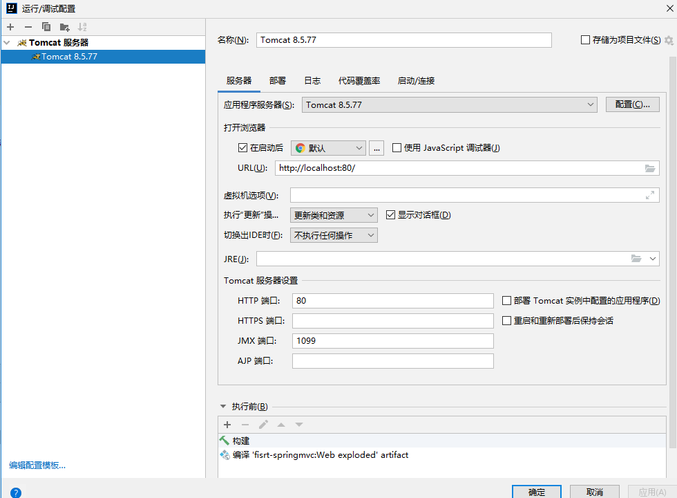

# Spring MVC环境配置
## 0. 新建工程，并配置web
### 0.1 新建web并修改目录结构


### 0.2 配置tomcat


## 1. Maven依赖spring-webmvc
```xml
    <dependencies>
        <dependency>
            <groupId>org.springframework</groupId>
            <artifactId>spring-webmvc</artifactId>
            <version>5.3.18</version>
        </dependency>
    </dependencies>
```
## 2. web.xml配置DispatcherServlet
**web.xml:**

```xml
<?xml version="1.0" encoding="UTF-8"?>
<web-app xmlns="http://xmlns.jcp.org/xml/ns/javaee"
         xmlns:xsi="http://www.w3.org/2001/XMLSchema-instance"
         xsi:schemaLocation="http://xmlns.jcp.org/xml/ns/javaee http://xmlns.jcp.org/xml/ns/javaee/web-app_3_1.xsd"
         version="3.1">
    <!--DispatchServlet -->
    <servlet>
        <servlet-name>springmvc</servlet-name>
        <!--
            DispatcherServlet是Spring MVC最核心的对象
            DispatcherServlet用于拦截Http请求，
            并根据请求的URL调用相应的Controller方法进行Http请求的处理
         -->
        <servlet-class>org.springframework.web.servlet.DispatcherServlet</servlet-class>
        <!-- 配置IoC容器的xml文件存放位置 -->
        <init-param>
            <param-name>contextConfigLocation</param-name>
            <param-value>classpath:applicationContext.xml</param-value>
        </init-param>
        <!--
            在web应用启动时自动创建Spring IOC容器，
            并初始化DispatcherServlet
         -->
        <load-on-startup>0</load-on-startup>
    </servlet>
    <!-- ServletMapping -->
    <servlet-mapping>
        <servlet-name>springmvc</servlet-name>
        <!-- "/"代表拦截所有请求 -->
        <url-pattern>/</url-pattern>
    </servlet-mapping>
</web-app>
```
## 3. 配置applicationContext的mvc标记

```xml
<?xml version="1.0" encoding="UTF-8"?>
<beans xmlns="http://www.springframework.org/schema/beans"
       xmlns:mvc="http://www.springframework.org/schema/mvc"
       xmlns:context="http://www.springframework.org/schema/context"
       xmlns:xsi="http://www.w3.org/2001/XMLSchema-instance" xmlns:mv="http://www.springframework.org/schema/mvc"
       xsi:schemaLocation="http://www.springframework.org/schema/beans
            http://www.springframework.org/schema/beans/spring-beans.xsd
            http://www.springframework.org/schema/context
            http://www.springframework.org/schema/context/spring-context.xsd
            http://www.springframework.org/schema/mvc
            http://www.springframework.org/schema/mvc/spring-mvc.xsd">
    <!--
        context:component-scan 标签作用
        在Spring IoC初始化过程中，自动创建并管理net.kokwind.springmvc及子包中
        拥有以下注解的对象。
        @Repository 存放在Dao类上，通常是与数据进行直接交互的类
        @Service 业务逻辑类，通常是放在Service类上
        @Controller 用于描述Spring MVC的控制器类
        @Component  组件，不好区分类型，就使用此注解
    -->
    <context:component-scan base-package="net.kokwind.springmvc" />
    <!--
        启用Spring的注解开发模式，默认为false
        mvc:annotation-driven 标签作用
        @Controller 用于描述Spring MVC的控制器类
        @RequestMapping 用于描述请求映射
        @ResponseBody 用于描述返回JSON数据
        @RequestParam 用于描述请求参数
        @PathVariable 用于描述请求路径参数
        @ModelAttribute 用于描述请求参数
        @SessionAttributes 用于描述Session属性
        @ExceptionHandler 用于描述异常处理
        @InitBinder 用于描述请求参数绑定
        @PreHandle 用于描述请求参数绑定
        @PostHandle 用于描述请求参数绑定
        @AfterHandle 用于描述请求参数绑定
        @PreHandle 用于描述请求参数绑定
        @PostHandle 用于描述请求参数绑定
        @AfterHandle 用于描述请求参数绑定
      -->
    <mvc:annotation-driven />
    <!-- 将图片/JS/CSS等静态资源排除在外，可提高执行效率 -->
    <mvc:default-servlet-handler/>
</beans>
```
## 4. 开发Controller控制器
新建`net.kokwind.springmvc.controller`包，在此包下新建controller测试类`TestController`
```java
package net.kokwind.springmvc.controller;

import org.springframework.stereotype.Controller;
import org.springframework.web.bind.annotation.GetMapping;
import org.springframework.web.bind.annotation.ResponseBody;

@Controller
public class TestController {
    @GetMapping("/test") //把test方法映射到路径为//localhost/test
    @ResponseBody //直接向相应输出字符串，不跳转页面
    public String test() {
        return "SUCCESS";
    }
}
```
把mvc的maven依赖包放到web目录下


此时启动tomcat，打开浏览器


相比servlet进行web请求的处理要便捷的多，Spring MVC框架简化了web处理的过程，你可以把`TestController`控制器看成原有servlet的替代品，在开发的时候编写标准的方法也不再去引入像servlet那样编写请求和相应对象，只需要在这些方法上增加对应的注解，就可以完成原本比较复杂的处理以及结果的返回了。这就是Spring MVC带来的便利之处。


## 5. Spring MVC数据绑定
### 5.1 URL Mapping（URL映射）
- URL Mapping指将URL与Controller方法绑定
- 通过将URL与方法绑定，Spring MVC便可通过Tomcat对外暴露服务

### 5.2 URL Mapping注解
- @RequestMapping- 通用绑定
- @GetMapping - 绑定Get请求
- @PostMapping - 绑定Post请求

### 5.3 新建一个URL测试类
在`net.kokwind.springmvc.controller`包下新建`URLMappingController`类
```java
package net.kokwind.springmvc.controller;

import org.springframework.stereotype.Controller;
import org.springframework.web.bind.annotation.GetMapping;
import org.springframework.web.bind.annotation.PostMapping;
import org.springframework.web.bind.annotation.ResponseBody;

//@Controller注解可以看做是servlet的替代品，它可以把一个类标识为一个controller
@Controller
public class URLMappingController {
    @GetMapping("/get")
    @ResponseBody
    public String getMapping() {
        return "This is a get mapping";
    }
    @PostMapping("/post")
    @ResponseBody
    public String postMapping() {
        return "This is a post mapping";
    }
}
```
启动Tomcat，打开浏览器
使用`get`方法时：


使用`post`方法时，因为我们映射的是`post`请求，所以提示405：


修改之前的`index.html`代码,添加一个表单按钮
```html
<!DOCTYPE HTML PUBLIC "-//W3C//DTD HTML 4.01 Transitional//EN"
        "http://www.w3.org/TR/html4/loose.dtd">
<html>
<head>
    <title>Title</title>
</head>
<body>
    <form action="/post" method="post">
        <input type="submit" value="Submit" />
    </form>
</body>
</html>
```
打开浏览器`localhost`，点击按钮


`post`就正常显示了


`@RequestMapping`注解用在类上来指定请求的全局映射路径，之后的`get`和`post`方法都会被映射到这个路径下
```java
package net.kokwind.springmvc.controller;

import org.springframework.stereotype.Controller;
import org.springframework.web.bind.annotation.GetMapping;
import org.springframework.web.bind.annotation.PostMapping;
import org.springframework.web.bind.annotation.RequestMapping;
import org.springframework.web.bind.annotation.ResponseBody;

//@Controller注解可以看做是servlet的替代品，它可以把一个类标识为一个controller
//@RequestMapping注解用在类上指定请求的全局映射路径，之后的get和post方法都会被映射到这个路径下
//localhost/method/get
//localhost/method/post
//@RequestMapping注解用在方法上表示不再区分get和post请求
@Controller
@RequestMapping("/method")
public class URLMappingController {
    @GetMapping("/get")
    @ResponseBody
    public String getMapping() {
        return "This is a get mapping";
    }
    @PostMapping("/post")
    @ResponseBody
    public String postMapping() {
        return "This is a post mapping";
    }
}
```

### 5.4 接受请求参数
之前的`index.html`表单里只要添加里一个提交按钮，正常的表单是带有数据的
Spring MVC接收请求参数的常用做法
- 使用Controller方法参数接收
- 使用Java Bean接收数据

#### 5.4.1 使用Controller方法参数接收
```html
<form action="/post" method="post">
    <input type="text" name="username">
    <input type="password" name="password">
    <input type="submit" value="Submit" />
</form>
```
修改`get`和`post`方法添加参数

```java
package net.kokwind.springmvc.controller;

import org.springframework.stereotype.Controller;
import org.springframework.web.bind.annotation.GetMapping;
import org.springframework.web.bind.annotation.PostMapping;
import org.springframework.web.bind.annotation.RequestParam;
import org.springframework.web.bind.annotation.ResponseBody;

//@Controller注解可以看做是servlet的替代品，它可以把一个类标识为一个controller
//@RequestMapping注解用在类上指定请求的全局映射路径，之后的get和post方法都会被映射到这个路径下
//localhost/method/get
//localhost/method/post
//@RequestMapping注解用在方法上表示不再区分get和post请求
@Controller
public class URLMappingController {
    //get请求也是可以通过?manager_name=lily这样的方式接收参数的，
    //这时需要使用@RequestParam把名字注入到参数里
    @GetMapping("/get")
    @ResponseBody
    public String getMapping(@RequestParam("manager_name") String managerName) {
        return "manager_name" + ":" + managerName;
    }

    @PostMapping("/post")
    @ResponseBody
    public String postMapping(String username, String password) {
        return username + ":" + password;
    }
}
```


#### 5.4.2 使用Java Bean接收请求参数
当表单要输入的参数特别多的情况下，我们需要在对应的方法里增加大量的参数，这样就非常不方便维护，所以可以新建一个实体类

```java
package net.kokwind.springmvc.entity;

public class User {
    private String username;
    private String password;

    public String getUsername() {
        return username;
    }

    public void setUsername(String username) {
        this.username = username;
    }

    public String getPassword() {
        return password;
    }

    public void setPassword(String password) {
        this.password = password;
    }
}

```
然后在对应的方法里，参数改成这个实体类就可以了。
```java
package net.kokwind.springmvc.controller;

import net.kokwind.springmvc.entity.User;
import org.springframework.stereotype.Controller;
import org.springframework.web.bind.annotation.GetMapping;
import org.springframework.web.bind.annotation.PostMapping;
import org.springframework.web.bind.annotation.RequestParam;
import org.springframework.web.bind.annotation.ResponseBody;

//@Controller注解可以看做是servlet的替代品，它可以把一个类标识为一个controller
//@RequestMapping注解用在类上指定请求的全局映射路径，之后的get和post方法都会被映射到这个路径下
//localhost/method/get
//localhost/method/post
//@RequestMapping注解用在方法上表示不再区分get和post请求
@Controller
public class URLMappingController {
    //get请求也是可以通过?manager_name=lily这样的方式接收参数的，
    //这时需要使用@RequestParam把名字注入到参数里
    @GetMapping("/get")
    @ResponseBody
    public String getMapping(@RequestParam("manager_name") String managerName) {
        return "manager_name" + ":" + managerName;
    }
    @PostMapping("/post")
    @ResponseBody
    public String postMapping(String username, String password) {
        return username + ":" + password;
    }

    @PostMapping("/post1")
    @ResponseBody
    public String postMapping1(User user){
        return user.getUsername() + ":" + user.getPassword();
    }
}
```
最后页面的表单跳转页需要修改为：
```html
<form action="/post1" method="post">
    <input type="text" name="username">
    <input type="password" name="password">
    <input type="submit" value="Submit" />
</form>
```


### 5.5 综合示例
接收如下表单的复合数据


```html
<!DOCTYPE html>
<html lang="en">
<head>
    <meta charset="UTF-8">
    <title>调查问卷</title>
    <style>
        .container {
            position: absolute;
            border: 1px solid #cccccc;
            left: 50%;
            top: 50%;
            width: 400px;
            height: 300px;
            margin-left: -200px;
            margin-top: -150px;
            box-sizing: border-box;
            padding: 10px;
        }
        h2{
            margin: 10px 0px;
            text-align: center;
        }
        h3{
            margin: 10px  0px;
        }
    </style>
</head>
<body>
    <div class="container">
        <h2>调查问卷</h2>
        <form action="./apply" method="post">
        <h3>您的姓名</h3>
        <input name="name" class="text"  style="width: 150px">
        <h3>您正在学习的技术方向</h3>
        <select name="course" style="width: 150px">
            <option value="java">Java</option>
            <option value="h5">HTML5</option>
            <option value="python">Python</option>
            <option value="php">PHP</option>
        </select>
        <div>
            <h3>您的学习目的：</h3>
            <input type="checkbox" name="purpose" value="1">就业找工作
            <input type="checkbox" name="purpose" value="2">工作要求
            <input type="checkbox" name="purpose" value="3">兴趣爱好
            <input type="checkbox" name="purpose" value="4">其他
        </div>
        <div style="text-align: center;padding-top:10px" >
            <input type="submit" value="提交" style="width:100px">
        </div>
        </form>

    </div>
</body>
</html>
```

- 利用数组或者List接受请求中的复合数据
- 利用@RequestParam为参数设置默认值
- 使用Map对象接受请求参数及注意事项
  - 如果当前表单不包含复合数据，可以使用Map接收，和实体类类似
  - 如果包含复合数据，则Map只能接收复合数据的第一条

新建一个控制器
```java
package net.kokwind.springmvc.controller;

import org.springframework.stereotype.Controller;
import org.springframework.web.bind.annotation.PostMapping;
import org.springframework.web.bind.annotation.ResponseBody;

@Controller
public class FormController {
    @PostMapping("/apply")
    @ResponseBody
    public String apply(@RequestParam(value = "name", defaultValue = "ANON") String name,String course,Integer[] purpose){
        System.out.println(name);
        System.out.println(course);
        for(Integer i:purpose){
            System.out.println(i);
        }
        return name + " " + course + " " + purpose.length;
    }
}
```
打开网页，提交如下数据


使用List接收复合数据
```java
package net.kokwind.springmvc.controller;

import org.springframework.stereotype.Controller;
import org.springframework.web.bind.annotation.PostMapping;
import org.springframework.web.bind.annotation.RequestParam;
import org.springframework.web.bind.annotation.ResponseBody;

import java.util.List;

@Controller
public class FormController {
    @PostMapping("/apply")
    @ResponseBody
    //1.使用数组接收复合参数
    public String apply(@RequestParam(value = "name", defaultValue = "ANON") String name, String course, Integer[] purpose){
        System.out.println(name);
        System.out.println(course);
        for(Integer i:purpose){
            System.out.println(i);
        }
        return name + " " + course + " " + purpose.length;
    }

    @PostMapping("/apply1")
    @ResponseBody
    //2.使用List接收复合参数
    public String apply1(@RequestParam(value = "name", defaultValue = "ANON") String name, String course, @RequestParam List<Integer> purpose){
        System.out.println(name);
        System.out.println(course);
        for(Integer i:purpose){
            System.out.println(i);
        }
        return name + " " + course + " " + purpose.size();
    }
}

```